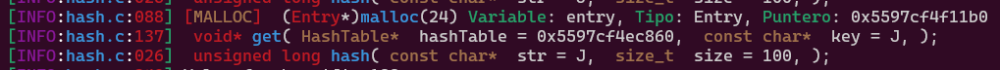

# DebugLibC

----

## Libreria debug_c.h

Una pequeña lib para el debug y mostrar informacion.

Se hace uso de la libreria [colors](https://github.com/desmonHak/colors-C-C-plus-plus)


La libreria usa la macro `DEBUG_ENABLE` para habilitar o deshabilitar el debug.

Usted debera compilar usando `-DDEBUG_ENABLE` para habilitar el debug tal como se muestra:

```bash
gcc -DDEBUG_ENABLE main.c -o main.elf
```

Todos lo relacionado con el debug se encuentra en el archivo `debug_c.h` y `debug_c.c`. El tema de los colores se encuentra en el archivo `colors.h` y `colors.c` el cual permite que podamos usar los colores en la consola. Si desea desabilitarlos compile con `__DISABLE_COLORS_FORE_BACK_GROUND__`, eso hara que las siguientes funciones no hagan nada: `background_color_custom_RGB`, `background_color_custom_`, `foreground_color_custom_RGB` y `foreground_color_custom_`. Se recomienda hacer esto en versiones de Windows 7, pues en algunos no funciona como deberia.

En caso de que en su codigo se producto algun tipo de error, al incluiir la libreria `debug_c.c` se mostrara un mensaje de error y el programa se cerrara. Se define los metodos `signalHandler`(linux) y el metodo `ExceptionHandler` (windows) para poder capturar el error y mostrarlo, junto al estado de los registros. (debera activar la macro `_ExceptionHandler`) para que este comportamiento funcione, podra hacerlo añadiendo `#define _ExceptionHandler` antes de incluir la libreria `debug_c.c` o la libreria `time_code.c` la cual ya incluye la anterior.

> Cabe mencionar que tambiene puede usar la macro ``_ExceptionHandler_WIN_``  que hara lo mismo que 
> `_ExceptionHandler`, la primera se mantiene por retrocompatibilidad con versiones anteriores de la > libreria.

### Macro ``DEBUG_PRINT``

La macro `DEBUG_PRINT` es una macro que permite imprimir mensajes de debug en la consola, esta macro se define en el archivo `debug_c.h` y se define como:
```c
#define DEBUG_PRINT(level, fmt, ...) debug_print(level, "#{FG:lgreen}[#{FG:lpurple}%s#{FG:reset}:#{FG:cyan}%s#{FG:reset}:#{FG:red}%03d#{FG:green}]#{FG:reset} " fmt , get_level_debug(level), __FILE__, __LINE__, ##__VA_ARGS__)
```

Esta macro solo sera usada si la macro `DEBUG_ENABLE` esta definida y ademas usa la funcion `debug_print` la cual usa `printf_color`. Usted puede hacer un `#undef DEBUG_ENABLE` y redefinir la macro para que imprima usando algun formato diferente o aporte alguna otra funcionalidad.

La macro `DEBUG_PRINT` tiene 3 parametros, de los cuales:

1. `level`: es el nivel de debug, este parametro es un entero que indica el nivel de debug, puede ser cualquiera de los siguientes:
```c
typedef enum {
    ERROR_LEVEL_INFO,
    ERROR_LEVEL_WARNING,
    ERROR_LEVEL_ERROR
} ErrorLevel;
```

Se recomienda usar `ERROR_LEVEL_INFO` en la mayoria de los casos a no ser que quiera reportar informacion importante o de error (warnings y erores).

El tercer paramatro es una cadena con la informacion que sea imprimir, esta cadena puede ser una cadena de texto o una cadena con formateadores como "Mi mensaje, code error: %d". Los siguientes parametros corresponde a los parametros que usar para formatear el string.

Por defcto se define un formato el cual usar para imprimir mensajes de debug en cada llamada, al inicio de cada funcion puede definir una algo como la siguiente:
```c
DEBUG_PRINT(DEBUG_LEVEL_INFO,
    INIT_TYPE_FUNC_DBG(void*, get)
        TYPE_DATA_DBG(HashTable*, "hashTable = %p")
        TYPE_DATA_DBG(const char*, "key = %s")
    END_TYPE_FUNC_DBG,
    hashTable, key);
```

Aqui `DEBUG_PRINT` indica que se imrpimira informacion de depuracion, `DEBUG_LEVEL_INFO` indica el nivel de depuracion que se usara, en este caso informativa. `INIT_TYPE_FUNC_DBG` indica que se imprimira informacion de la funcion, "void*" corresponde al tipo de dato que retorna la funcion mientras que "get" corresponde al nombre de la funcion actual. Por cada argumento existen en la funcion se usara un `TYPE_DATA_DBG` que indica el tipo de dato y una cadena con el nombre del argumento, ademas permite que usted infique , que formateador usara para imprimir esta informacion. Para finalizar la informacion de debug, se añadira la macro `END_TYPE_FUNC_DBG` y acontinuacion se parara todos los parametros de la funcion actual, para formatear el string de debug que se imprimira, esto se aplico a la funcion:
```c
void* get(HashTable* hashTable, const char* key);
```

Lo cual hace que se vea asi:


### Macros `debug_malloc`, `debug_calloc` y `debug_realloc`

Las macros `debug_malloc`, `debug_calloc` y `debug_realloc` son macros que permiten hacer un debug de las funciones `malloc`, `calloc` y `realloc` respectivamente. Estas macros se definen en el archivo `debug_c.h` y se definen como:
```c
#define debug_malloc(type, name_var, size) \
        name_var = (type*)malloc(size); \
        DEBUG_PRINT(DEBUG_LEVEL_INFO, "#{FG:red}[#{FG:yellow}MALLOC#{FG:red}]#{FG:lred}  #{FG:white}(#{FG:lred}%s#{FG:white}*)#{FG:cyan}malloc#{FG:white}(%d) #{FG:lgreen}Variable#{FG:white}: %s, #{FG:lgreen}Tipo#{FG:white}: %s, #{FG:lgreen}Puntero#{FG:white}: %p\n", #type, size, #name_var, #type, name_var); \
        if (NULL == name_var) puts("malloc error");

#define debug_calloc(type, name_var, cantidad, size) \
        name_var = (type*)calloc(cantidad, size); \
        DEBUG_PRINT(DEBUG_LEVEL_INFO, "#{FG:red}[#{FG:yellow}CALLOC#{FG:red}] #{FG:white}(#{FG:lred}%s#{FG:white}*)#{FG:cyan}calloc#{FG:white}(%d, %d) #{FG:lgreen}Variable#{FG:white}: %s, #{FG:lgreen}Tipo#{FG:white}: %s, #{FG:lgreen}Puntero#{FG:white}: %p\n", #type, cantidad, size, #name_var, #type, name_var); \
        if (NULL == name_var) puts("calloc error");

#define debug_realloc(type, name_var, size) \
        name_var = (type*)realloc(name_var, size); \
        DEBUG_PRINT(DEBUG_LEVEL_INFO, "#{FG:red}[#{FG:yellow}REALLOC#{FG:red}] #{FG:white}(#{FG:lred}%s#{FG:white}*)#{FG:cyan}realloc#{FG:white}(%p, %d) #{FG:lgreen}Variable#{FG:white}: %s, #{FG:lgreen}Tipo#{FG:white}: %s, #{FG:lgreen}Puntero#{FG:white}: %p\n", #type, name_var, size, #name_var, #type, name_var); \
        if (NULL == name_var) puts("realloc error");
```
Estas macros comprueban que el puntero devuelto por las funciones `malloc`, `calloc` y `realloc` sea diferente de `NULL`(error de reserva de memoria).
Para poder usar estas macros, es necesario definir antes la variable que se parara como `name_var`, `size` debera ser el tamaño de la memoria a reservar, `cantidad` sera la cantidad de elementos a reservar y `type` sera el tipo de dato que se 'casteara' a un puntero.
Esto hara que se muestre algo similar a lo siguiente:
```c
[INFO:hash.c:088] [MALLOC]  (Entry*)malloc(24) Variable: entry, Tipo: Entry, Puntero: 0x5597cf4f11d0
```
lo cual corresponte a esto:
```c
Entry* entry;
debug_malloc(Entry, entry, sizeof(Entry));
````


----

## Libreria time_code.h

la pequeña libreria incluye a la libreria `debug_c.h` y agrega funcionalidades para medir el tiempo de ejecucion de su codigo, usted no tendra que llamar a ninguna funcion adicional para hacer esto, solo debe incluir la libreria `time_code.h`.

----